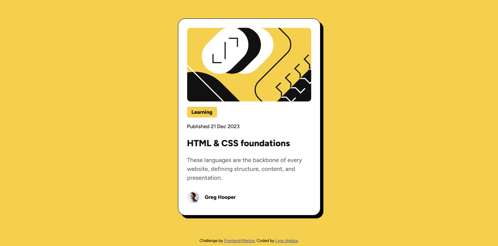

# Frontend Mentor - Blog preview card solution

This is a solution to the [Blog preview card challenge on Frontend Mentor](https://www.frontendmentor.io/challenges/blog-preview-card-ckPaj01IcS).

## Table of contents

- [Overview](#overview)
  - [The challenge](#the-challenge)
  - [Screenshot](#screenshot)
  - [Links](#links)
- [My process](#my-process)
  - [Built with](#built-with)
  - [What I learned](#what-i-learned)
  - [Continued development](#continued-development)
  - [Useful resources](#useful-resources)
- [Author](#author)

## Overview

### The challenge

Users should be able to:

- See hover and focus states for all interactive elements on the page

### Screenshot



### Links

- Solution URL: [Frontend Mentor]()
- Live Site URL: [Vercel](https://blog-preview-card-gamma-neon.vercel.app/)

## My process

### Built with

- Semantic HTML5 markup
- CSS custom properties

### What I learned

I learned about creating interactive card elements using CSS hover effects and filter properties.

Hover effects:

```css
.card:hover .title {
  color: var(--yellow);
  transition: 0.5s ease-in-out;
}
```

Drop shadow effect using filter:

```css
filter: drop-shadow(8px 8px black);
```

### Continued development

I tried to apply what I learnt from the [qr component project](https://github.com/lynnagidza/qr-code-component) by removing redudant code ih my CSS files and applying [landmarks](https://dequeuniversity.com/rules/axe/4.2/landmark-one-main?application=axeAPI) in my HTML file.

### Useful resources

- [CSS Transitions](https://developer.mozilla.org/en-US/docs/Web/CSS/transition) - This helped me create a smoother on-hover transition.
- [CSS filter](https://developer.mozilla.org/en-US/docs/Web/CSS/filter) - This is an amazing article which helped me understand how to create a dop shadow effect in pure CSS.

## Author

- Website - [Lynn Agidza](https://lynnagidza.github.io/)
- Frontend Mentor - [@lynnagidza](https://www.frontendmentor.io/profile/lynnagidza)
